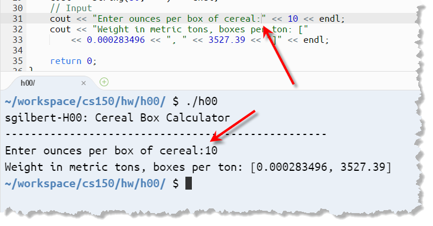

<head>

</head>

# Chapter 1  An Overview of C++

**This is the Course Reader for CS 150, C++ Programming I, Fall 2019, at
Orange Coast College**. CS 150 is a **second course** in computer
science, so you should know some basic programming constructs:
variables, input and output, calculations, loops, decisions, functions
and arrays.

The reader is **goal-oriented**; each chapter has a homework problem, 
and the rest of the chapter shows you how to solve
it, presenting the necessary parts of C++ as they are encountered.
**Read the textbook while sitting at your computer**.

I've tried to make the reader **short and concise**, focusing on the parts 
you need to get your work done. Throughout the text, though, you'll find 
links pointing to additional reading. If you aren't familiar with a concept
from an earlier course, please read the linked material.

If you want to know all of the details, then consult one of these highly recommended texts:

  - *The C++ Primer, 5th Edition* by Lippman, Lajoie and Moo
  - *The C++ Programming Language, 4th Edition*, by Bjarne Stroustrup

## About C++ Versions

C++ is a **standardized** programming language, whose specification is controlled by the
**International Standards Organization** or **ISO**. Any company is free to implement the C++ language and standard libraries without fear of lawsuits. There are several **different versions** of C++ that have been developed:

  > The version of C++ available in the 1980s and 90s is known as **pre-standard C++**. There were several pre-standard C++ versions of C++, and they were often incompatible with eachother.

  > The first C++ standardized version of C++ was released in  effort by the ISO began in 1990, culminating in the 1998 release of **Standard C++**, also known as **C++98**. This was updated in 2003.

  >In 2011, the second **major** version of C++ was released, **C++11**. This was followed by **C++14** and **C++17**. Most major C++ vendors now support C++17.

At the end of 2019, work is now proceeding on the next version of C++, **C++20**.

*In this course we will use several C++11+ features, so you'll need to
use a compiler that supports it. In class, and for your homework,
we'll use g++ on Linux, using Harvard's CS50 IDE.*

# What is C++? 

In the early days of computing, programs were
written in **machine language**, the primitive instructions that can be
executed directly by your computer's CPU. Machine language is also known
as **native code**. Programs written in machine language are difficult
to understand and inherently **non-portable**.

In the mid-1950s, programmers under the direction of John Backus at IBM
produced the initial version of **FORTRAN** (whose name is a contraction
of **for**mula **tran**slation), which was the first example of a
**high-level programming language**. Since that time, many new
programming languages have been invented, most of which build on
previous languages in an evolutionary way.

One of the C++ ancestors
is a language called **C**, designed at Bell Laboratories by **Dennis
Ritchie** in 1970 as part of the development of the UNIX operating
system with **Ken Thompson**. Thompson originally wrote
UNIX in PDP-7 assembly language, which
made it difficult to "port", so that it would work on different
machines. Later, Thompson re-wrote UNIX
in a language that he invented, named B, which itself was a translation
of an earlier language developed at MIT called BCPL. Ritchie took the
language B, and developed C.

C was revised and standardized by the American
National Standards Institute (ANSI) in 1989. In addition to C, C++
*also* descends from a family of languages designed to support a
different style of programming that has dramatically changed the nature
of software development in recent years.

## The object-oriented paradigm 

In the **procedural programming** style, programs consist of a
collection of procedures and functions that operate on data. In
**object-oriented** programming, programs are viewed instead as a
collection of components that embody particular characteristics and
behavior. The first object-oriented language was SIMULA, a language for
coding simulations designed by the Scandinavian computer scientists
Ole-Johan Dahl and Kristen Nygaard in 1967. Much of the terminology used
to describe object-oriented languages comes from the original 1967
report on SIMULA.

There
are several object-oriented languages based on C, (such as Objective-C,
used on the Mac), but the most successful is C++, developed by **Bjarne
Stroustrup** at AT\&T Bell Laboratories in the early 1980s. C++ is
designed to be a **multi-paradigm** language; it supports *both*
procedural *and* object-oriented programming (as well as the style known
as **generic** programming). Unlike **idealistic** languages that
enforce a "one true path", C++ is **pragmatic**; it supports procedural
and object-oriented programming, as well as **generic
programming** which you'll meet later in the semester.

## How is C++ Different from Java or Python?

C++ is a **compiled**, high-level language. Unlike Java, C\# or Python
compilers which produce an intermediate-level **bytecode** that is
then **interpreted** by a **virtual machine**, C++ compilers
produce **native machine code** which runs directly on the CPU.

Because of this, C++ programs are often **much more efficient** than
Java, Python or C\# programs. Because your code runs directly on the
hardware, however, instead of inside a supervising virtual machine,
certain kinds of runtime errors, such as accessing elements outside the
bounds of an array, cannot be detected.

# The First C++ Program 

According to Dennis Ritchie\[1\], "*The first program to write is the
same for all languages: print the words hello, world.*" Here's a very
simple C++ version of “Hello World”:

**\#include** \<iostream\>

**int** **main**()

{

std::cout \<\< "hello, world\\n";

**return** 0;

}

To create your own C++ programs, you follow a mechanical process, a
well-defined set of steps called the **edit-build-run cycle** that looks
like this:

If you are coming from Python (or even Java or C\#) this is more complex
than what you are used to. In actual practice it is not any more
difficult; you just have more options.

1.  Create your **source code** using an editor

2.  Build your executable using a **compiler toolchain**

3.  Run your program using your operating system facilities

Learning this process is **necessary** before you can learn to program,
but it is **not** the same as learning how to program;
you **must** master the process, but mastering the process doesn't
mean you'll write correct and elegant programs.

## The CS 50 IDE

The **build process** which turns source code into an executable
involves several tools:

  - **Preprocessor**—performs text substitution on your source code.

  - **Compiler**— converts the preprocessed to code to **object code**.

  - **Assembler**—used by the compiler to produce the object code.

  - **Linker**—combines object modules to produce an executable that can
    be run.

  - **Make**—provides instructions for building each program.

  - **Loader**—reads the executable from disk into memory and starts it
    running.

<!-- end list -->

  - **Debugger**—allows you to run your program inside a controlled
    environment.

A particular **combination** a C++ compiler, linker, assembler and
libraries is known as a **toolchain**. The toolchain that we'll be using
for your assignments and in class is called c**lang++**, the same
toolchain used to develop C++ programs on the Mac. On your exams (in the
Computing Center), we'll use a different toolchain.

# H00—A Real C++ Program

This reader is **goal-oriented**, so let's define a problem and then
solve it.

> *A metric ton is* **35,273.92** *ounces. Write a program that will
> read the weight of a package of breakfast cereal in ounces and output
> the weight in metric tons as well as the number of boxes needed to
> yield one metric ton of cereal.  
> \--Savitch, Absolute C++ 5th Edition, Chapter 2*

This is an **interactive** **IPO** (*Input*, *Processing*, *Output*)
programs. You'll type the input at the keyboard in response to
a **prompt**, and the output will be displayed on your monitor. If you
find this "old fashioned", rest assured that the concepts you learn will
remain the same for even the most sophisticated program.

## The IPO Concept

I like mental pictures, so I think of a
computer as an **information processor**; like a *Cuisinart* for words,
numbers and ideas. Instead of vegetables, we feed our computer **data**;
the raw facts figures and symbols we have to work with. The computer
uses a **program** stored in memory, to turn that data
into **information** that's organized, meaningful and useful. In
fact, **every program** is based on this fundamental concept: input
some data, process it and produce some information.

## What It Looks Like and What It Does

Let's start by thinking about what you **want the interaction to look
like**. Planning this out ahead of time will make developing your code
much easier. Here's a possibility:

> sgilbert-H00: Cereal Box Calculator  
> \------------------------------------------------------  
> Enter ounces per box of cereal: 10  
> Weight in metric tons, boxes per ton: \[0.000283496, 3527.39\]

In the illustration shown here I've displayed the input values in blue,
and the calculated output values in dark red. I've placed the output
values inside brackets, so I'll be able to find them when it comes time
to test my program. When we actually run the program everything will be
displayed in the console in a single color. I've also displayed an
introduction and my user name and assignment number in the program
heading.

## CS 150 Starter Code

For each assignment, I’ll provide you with a set
of “starter files” that provide a framework for running and testing
simple C++ programs. Make sure that you have created the **cs150** and
the **hw** folders in class (*as shown below*), and switch into your
homework folder using the command **cd \~/workspace/cs150/hw**.

Next, download the **h00.zip** file from Canvas to your local machine.
From there, you can unzip it and drag and drop the folder to your online
**hw** folder. Alternatively, you can drag the zip file to your
workspace and, once it has been uploaded, unzip it using the command:
**unzip** **h00.zip**. You may delete the zip file at this point using:
**rm h00.zip**. Once you have done that, you can open the ***source
code*** for this problem by double-clicking **h00.cpp** in the file
pane.

## Identify Yourself

There are three places you'll need to add **identification** to every
project you build.

  - First, in the **file documentation comment** at the top of the
    program, add your name after the **@author** tag and the date after
    the **@date** tag. You can just use the semester for the date if you
    like, but tell me what section you are in.

  - Next, find the **STUDENT** variable and fill in in with
    your **Canvas login ID**. I use this as a sorting key when
    processing the assignments; if you do this wrong, you will not
    receive any credit for an assignment.

# Designing a Solution

When it comes to programming, C++ is like any other language in at least
one way:  
**all** programming **starts with planning and design**. Before we can
write our C++ program, we have to spend time thinking about the inputs,
processing and outputs.

  - **Always** design your programs **before** you start writing code.

  - What are
    the **inputs**, **outputs**, **algorithms** and **assumptions**?

<!-- end list -->

  - **Write it in English** before you ever start writing in C++.

> ***Remember:** the sooner you start writing code, the longer it will
> take you to finish.*

## A Preliminary Solution

Here is some information that we can discover from the problem
description:

  - **Input**: weight of a box of cereal in ounces

  - **Output**: weight of box in metric tons *and* number of boxes in a
    metric ton.

  - **Given**: metric ton is **35,273.92** ounces

  - **Calculation**: the weight in metric tons is equal to the weight in
    ounces divided by the number of metric tons per ounce.

  - **Calculation**: the number of boxes per metric ton is equal to one
    divided by the weight of a single box in metric tons.

Although you shouldn't jump in and start coding at this point, there is
no reason you can't use your computer; put your design information into
a **program comment** before you begin writing your code. But first,
let's look at the basic structure of a C++ Program.

## The Basic Structure of a C++ Program

Every C++ program has a ***function*** named **main()**. When you scroll
down in **h00.cpp** you'll find a **function** named **run()** preceded
by a **documentation comment**. Instead of **main()**, we will be using
**run()** for our simple IPO programs to simplify the process of testing
your code. The actual **main()** function is contained inside the
library file **libh00.a**.

## Comments 

A **comment** is text that is ignored by the compiler. C++ has two kinds
of comments, single-line and paired comments. In CS 150 we'll also use
**documentation comments** that can be processed using a tool called
**Doxygen**. The CS150 reference has the specification for the required
documentation comments.

**Internal documentation** (such as that needed by the programmer to
implement the function), **should not** go in the documentation comment,
but should appear in an **implementation comment** inside the function.
Place that in the **run()** function, like this:

> *Using single-line comments is easier than using paired comments,
> because your IDE has a shortcut key to generate them (Shift+/).*

# Performing Output

The easiest way to start coding an IPO program is being by **mocking up
the interaction**, using plain output, substituting both input and
output values with **literals**.

## Using the Standard C++ Library

Input and output is part of the C++ standard library. Modern programs
are never written without using **libraries**—collections of useful
components. C++ contains a **standard library** which is divided into a
number of packages, known as **headers**. To gain access to the
**iostream** module, used for input and output, your program must
contain the line

**\#include** \<iostream\>

This line instructs the **C++ preprocessor** to *read the relevant
definitions* from what is called a **header file**. The angle brackets
in this line indicate that the header file is a ***system library***
that is part of standard C++.

> Later in this course you will also use header files that you have
> written yourself or that come from other libraries. **Those** header
> files typically end with **.h** and are **enclosed in quotation
> marks** instead of angle brackets.

Instructions to the preprocessor are called **preprocessor directives**;
these always appear on a line by themselves, and always start with a
**\#**.

## The Standard Namespace

Using **\#include** alone is not sufficient; libraries further divided
into "families" called **namespaces**. The standard library namespace is
**std**, (usually pronounced **standard** instead of "es-tee-dee"). When
you use a component such as **string** or **cout** you must let the
compiler know to which namespace the name belongs.

There are several ways to do this, but the easiest is to add a **using
directive** to the top of your source code, like this:

**using namespace** std;

For other methods, see the reference for this section.

## Mocking Up the Output

The C++ **standard library output object** is named **cout** (analogous
to **System.out** in Java). Instead of using methods, like **print()**
and **println()**, you use it along with the **insertion** (or **"put
to"**) **operator** **\<\<** like this:

The **arguments** sent to **std::cout** are printed from left to right,
with each being separated from the others by the insertion operator. All
of the output statements are placed inside the braces that make up the
body of the **run()** function.

Let's look at each of the sections:

1.  The first line has **four arguments**: your student ID and the
    assignment number, stored in two **variables** that have been
    previously defined, and two **string literals**, one containing a
    hyphen and the other containing a colon followed by a space.
    **String literals** consist of text inside of **double quotes**.  
      
    Each output line ends in a **semicolon**, the C++ statement
    terminator (like a period in a sentence). Each line (except the
    first), also ends with the special value named **std::endl**,
    pronounced "*end-ell*", which represents the **newline character**
    on your platform. That means the first two source code lines will
    produce one line of output.

2.  The second section (line 28 in the code shown here), creates a C++
    **string** object by using a **constructor**. This **string** will
    consist of 50 hyphens. To use the C++ **string** type, the starter
    code includes the **\<string\>** header.

3.  The third section is the **input section**. I have separated (and
    highlighted) the numbers in the code that I expect to **receive as
    input from the user** from the literal text which will not change
    when the program is run. There are no quotation marks around those
    numbers.

4.  I have done the same thing in the last section of which will be the
    **program's output.** This style of mockup will make the subsequent
    development of the program a little easier because you won't have to
    change the output text and possibly mess up the spacing.

# Compile, Link & Run

Once you've entered **and saved** your source code, you're ready
to **compile** and **link** it. This is called **building** the
program, and is done by running a program named **make**. Switch to the
terminal, make sure you are in the **h00** folder, and then, simply type
**make**.

1.  The **make** program reads the **makefile** and ***compiles*** the
    **.cpp** file

<!-- end list -->

5.  If everything compiles correctly, the **linker** combines the two
    object-code file with the library and produces the executable.

6.  To run the program, type **./h00** (the name of the executable), or
    **make run**.

The output appears in the terminal window, and it looks exactly like the
interactions dialog we mocked up. So let's turn our attention to
**input** and **processing**.

> **Shortcut**: use *Contol+L* to open a terminal on a particular file.

## No\! Wait\! Something Went Wrong\!\!\!\!

Of course it's possible that your code **didn't** compile and run
successfully. There are two errors that can occur at this point:

  - **Syntax** or **compiler** errors occur when you have broken one of
    the grammar rules of C++. If that occurs, instead of the output you
    expect, you'll see an (often inscrutable) error message in the
    output pane instead, perhaps like this:

<!-- end list -->

1.  Scroll up to the **first** error that appears in the output window
    and make note of the file name and line numbers.

2.  The second line of the error message will attempt to show you
    exactly where the compiler got confused. In this case, it is right
    before the literal number **10**.

3.  Finally, go to the text editor and **fix the problem**. This is
    where things get tricky. The compiler actually **doesn't know** what
    you intended to write, so the solution it recommends is often
    incorrect. If you **do** add a semicolon where it suggests, then
    that will just trigger another message. The actual solution in this
    case is to add the insertion operator (**\<\<**) that we've
    forgotten between the operands.

> Once you've corrected **and saved** your source code, compile again to
> see if you've fixed the problem. You can't go onto the next step until
> there are no errors.

  - **Logic errors** or **bugs** occur when your program **doesn't do
    what it is supposed to do**. If the output of the program looks like
    this when you run it then you have a **logic error**, because you
    removed a space that was supposed to appear in the output.

> 

# Input, Processing and Output

Since our program now looks exactly like
the **interactions dialog** we mocked up, we can turn our attention
to **input and processing**. To do that, we'll need to:

  - Create **variables** to hold the **input** and the **results** of
    our calculations.

  - Use the C++ standard library **input object** named **cin (***see
    in*) along with the **extraction** or **input** operator **\>\>**.

  - Write some **expressions** that calculate the values our program
    should produce and store those in yet another set of variables.

<!-- end list -->

  - Display the results and **test** to see that they are correct.

## Reading Input

Here's the input section as I've completed it.

We only need to read one input value: the number of ounces per box. To
do that, we'll first create a **variable** to hold the input. Because
cereal boxes often contain a fractional portion of an ounce, we need to
use the data-type called **double**. When we name our variable, I prefer
to use the ***camelCase*** style; you may prefer to use all lowercase
with underscores separating the parts of the word, which is fine.

To **read input** from the user, we first **prompt for the information**
that we expect to be typed and then read the input from the standard
input stream **cin** ; the **cin** object is the counterpart to **cout**
and reads from **standard input**, which is your terminal by default.

### Prompting for Input

Notice that the "mockup" data previously appearing on the prompt line
has been removed, as well as the newline (**endl**) appearing after the
prompt. When you display a prompt for input, you generally omit
the **endl** at the end of the line so that the prompt appears on the
same line as the user input. Alternatively, you may use the **literal
newline escape character** embedded in quotes like this: **"\\n"**.

In addition, you should make sure that the prompt **ends in a single
space**, so that it displays the prompt but leaves the console
cursor–the blinking vertical bar or square that marks the current
input position at the end of the line, waiting for the user's response.

This is such a common occurrence that we can consider it a pattern: the
**Prompt then Input** pattern has two activities:

1.  Request the user to enter a value (**prompt**).

<!-- end list -->

7.  Obtain the value for the variable (**input**).

### Converting Input Data

This final statement in the marked section reads a sequence of
characters typed by the user at the keyboard, and stores the results in
the variable named **ouncesPerBox**. Because this variable was declared
as a **floating point** (**double**) variable, the **\>\>** operator
**automatically converts** the characters typed by the user into a
floating-point value.

# Processing and Output

Although we could just do our calculations as part of the output, I
encourage you to **create variables to hold the output values** as well.
We want to print two different values, so I'll create two variables:
**weightInMetricTons** and **boxesPerMetricTon**. Using the algorithm we
developed when designing the program, we can initialize those variables
like this, and then replace the "mockup" values from our output with the
new calculated values like the screenshot shown here

In C++, variables that are not initially given a value; instead, they
use whatever random value happens to be in memory at that time. (This is
different than Java which prohibits assigning to un-initialized
variables). Instead of first creating the variables and then calculating
and assigning a value, I recommend that you create variables **only when
you can calculate an initial value**.

## A Small Improvement: Constants

While our program looks OK, it does have one small flaw. The original
problem statement we were **given** specified the number of ounces in a
metric ton using the literal value **35,273.92**. However, in our
calculations, we **don't** want to use literal **"magic numbers"** such
as this: they are too easy to mistype and they make the code more
confusing. Instead, you should **store all "given" values in named
constants** like this:

Constants can appear inside your function (as I've done here), or, if
you intend to use them throughout your program, you can enter them
before the **run()** function.

# Testing Your Program

How do we know if our program is correct? Simple; need to **test** it.
To test it, we need to supply several input values, and then figure
out,** exactly what the output should b**e. The easiest way to do that
is to use Excel or Google Docs like this:

Since we haven't formatted any of our output, you might have to adjust
the number of decimal places for each portion.

## The CS 150 Testing Framework

The **CS 150 framework** includes a simple testing scheme for IPO
programs. Here's how it works.

  - For each new input you want to test, **add a new line** to the file
    **h00.tests**  
    (which you'll find in the folder with your starter code). If there
    are multiple inputs, then separate them with a space or a newline
    (**\\n**).

  - Add a vertical bar (**|**) to **separate the input from the expected
    output**, and then type the output that you want to check.

  - **T**he values being checked appear between square brackets (**\[
    \]**) in your program. If you have multiple outputs, they must all
    appear between a single set of brackets. **Do not** put the square
    brackets in your test file, however.

  - To run the program, type **make test**

When run like this, instead of reading the input from the keyboard,
input will be read from the text file, and each line of input will be
compared to the expected output.

In the copy of **h00.tests** that you downloaded, I've already
calculated several sizes of boxes from **5** ounces up to **32** ounces
using Google Docs, and then adjusted the decimal places so that they
matched the default used by C++. I also set the input for the last entry
to **35273.92** (the number of ounces in a metric ton), just to check
that we got **1** as the output each of our calculations.

Run the program, and you'll see it now tries several input values, and
then checks to see if you have the correct values.

At the bottom of the run is the score. Make sure that **your ID**
correctly appears, and that the assignment displayed is also correct.
The final line is the completion code. To submit this for credit, make
sure you have set up the environmental variables **during the first
class meeting**. To check, type: **echo $CS150USER**. You should see
your student (Canvas) login ID. If your username and ID look correct,
then submit with: **make submit**

You'll receive a confirmation if your submission is accepted. The **CS
150 Homework Console** allow you to check your past scores and see about
future deadlines.

# RAM, Bits, Bytes, and Words 

**We're going to finish up this week with a little bit of background
information about how information is stored in your computer.** The
three logical parts of a computer are its CPU, I/O devices and its
**memory**. Memory consists of special integrated-circuit chips called
***RAM***, which stands for ***random-access memory***. Random-access
memory allows the program to use the contents of any memory cell at any
time.

All of the data values stored in memory—no matter how complex—are stored
as combinations of the fundamental unit of information, which is called
a **bit.** Each bit can be in one of two possible states. If you think
of the circuitry inside the machine as if it were a tiny light switch,
you might label those states as *off* and *on*. Because the word bit
comes originally from a contraction of **binary digit**, it is more
common to label those states as **0** and **1**, which are the two
digits used in the binary number system on which computer arithmetic is
based.

Since a single bit holds so little information, individual bits are
collected together into larger units. The of these is called a **byte**,
which (usually) consists of eight bits and is large enough to hold a
value of type **char** (in C++). On most machines, bytes are assembled
into larger structures called **words**, where a word is defined to be
the size required to hold a value of type **int**. Today, most words are
either four or eight bytes (32 or 64 bits).

## Amount of Memory

The amount of memory available varies considerably. Early machine
memories were measured in kilobytes (KB); the machines of the 1980s and
’90s had memory measured in megabytes (MB); today’s machines have
memories measured in gigabytes (GB).

In the sciences, **kilo**, **mega**, and **giga** stand for one
thousand, one million, and one billion, respectively. In the computer
world, those base-10 values do not fit as well, so, by tradition these
represent the **power of two** closest to their traditional
interpretations:

| kilo (K) | 2*10* | 1,024         |
| -------- | ---------------- | ------------- |
| mega (M) | 2*20* | 1,048,576     |
| giga (G) | 2*30* | 1,073,741,824 |

A 64KB computer from the late 1970s would have had 64 x 1024 or 65,536
bytes of memory. Similarly, a modern 8GB machine would have 8 x
1,037,741,824 or 8,589,934,592 bytes of memory.

# Binary and Hexadecimal 

**A value is simply a set of bits, interpreted according to its type**.
A sequence of bits can represent an integer, a character, or a
floating-point value, each of which requires some kind of encoding
scheme. The easiest encoding scheme is that for **unsigned integers**.

The bits in an unsigned integer are interpreted using **binary
notation**. Binary notation is similar to the decimal notation you are
familiar with, but uses **2** rather than **10** as its **base**. The
base of a number system determines how many digits are used. In binary,
only two digits are used: **0** and **1**.

The value assigned to each digit **depends on its position** within the
number. The rightmost digit represents the "ones" place. The next place
over is the twos place, the fours place, the eights, and so on. This
should be familiar to you because we do the same thing in decimal with
the ones, tens, hundreds, and thousands place. For example:

When **interpreted as an unsigned integer**, these bits represents the
number forty-two:

As you can see, writing numbers in binary is tedious because they tend
to be so long. Decimal, though, but make it harder to understand how the
bits are stored.

## Hexadecimal Notation

Instead of using binary, computer scientists
often use **hexadecimal**, or base **16**. In **hex**, there are
**sixteen digits**, **0** through **F**, representing values from **0**
to **15**. The letters **A** through **F** represent the decimal values
**10**, **11**, **12**, **13**, **14** and **15**. Each hex digit uses 4
bits, so we can easily convert between hex and binary. Forty-two is
converted like this:

The first four bits are ***hex*** **2**, and the next four ***hex***
**10**. You can then verify that this number still has the decimal value
**42** by adding up the digit values, as follows:

The key point here is that **the number is always the same**; the
numeric base affects **only** the **representation**. Forty-two has a
real-world interpretation that is independent of the base. That
real-world interpretation is perhaps easiest to see in the
representation an elementary school student might use, or "base 1":

The number of line segments in this representation is forty-two. The
fact that a number is written in binary, decimal, or any other base is a
**property of the representation** and not of the number itself.

# Study Guide Questions

  - What are two reasons we don't generally program in machine language?

  - What was the first high-level language developed, who developed it
    and where, and what did its name stand for?

  - What are the three major versions of C++?

  - Who developed the C language? When? Where?

  - The C++ language is based mostly on features from which two earlier
    languages?

  - What are the major differences between C++ and Java? Between C++ and
    Python?

  - Are there any syntax errors in the following C++ program: **int
    main() {}**. Will it compile? Will it link? Will it run?

  - Are there any errors in this C++ program: **int Main() { return 0;
    }**. Will it compile? Will it link? Will it run?

  - Look at the following program from your text:

**\#include** \<iostream\> // 1.

**int** **main**() // 2.

{ // 3.

std::cout \<\< "hello, world\\n"; // 4.

**return** 0; // 5.

} // 6.

What tool is used to create this file? What is the extension of the
file? What tool is used to handle line 1. What is line 2 called? What
does line 3 mean? What is the **\\n** in line 4? What does the **std:**:
in line 4 mean? What is **cout?** Where is the **0** in line 5 returned
to? What does line 6 mean?

  - \_\_\_\_\_\_\_\_\_\_\_\_\_\_\_\_\_\_\_\_\_\_\_\_\_\_ performs text
    substitution on your source code.

  - \_\_\_\_\_\_\_\_\_\_\_\_\_\_\_\_\_\_\_\_\_\_\_\_\_\_ converts source
    code to object code.

  - \_\_\_\_\_\_\_\_\_\_\_\_\_\_\_\_\_\_\_\_\_\_\_\_\_\_ is used by the
    compiler to produce object code.

  - \_\_\_\_\_\_\_\_\_\_\_\_\_\_\_\_\_\_\_\_\_\_\_\_\_\_ combines object
    modules to produce an executable

  - \_\_\_\_\_\_\_\_\_\_\_\_\_\_\_\_\_\_\_\_\_\_\_\_\_\_ copies the
    executable bits from disk into memory and starts your program
    running.

  - The instructions for building each program are placed into a type of
    project file. The program that interprets those instructions is
    called \_\_\_\_\_\_\_\_\_\_\_\_\_\_\_\_\_\_\_\_\_\_\_\_\_.

  - To run your program inside a controlled environment, use a
    \_\_\_\_\_\_\_\_\_\_\_\_\_\_\_\_\_\_\_\_\_.

  - Describe the three kinds of comments we'll use in CS 150, their
    syntactical differences and their purposes. What are the three tags
    that each file you create must have?

  - What are the four things you need to know when you start designing a
    program?

  - To use any of the C++ standard library facilities, you'll need to
    insert a \_\_\_\_\_\_\_\_\_\_\_\_\_ directive named
    \_\_\_\_\_\_\_\_\_\_\_\_\_\_ into your source code.

  - What are two ways to specify that a function or object is from the
    standard library?

  - Text between double quotes in your program is known as a
    \_\_\_\_\_\_\_\_\_\_\_\_\_\_\_\_\_\_\_\_.

  - C++ simple statements end with \_\_\_\_\_\_\_\_\_\_\_\_\_\_\_\_\_.

  - The newline character can be output in which two ways?

  - The C++ library type that contains character is called
    \_\_\_\_\_\_\_\_\_\_\_\_\_\_\_\_\_\_\_\_\_\_\_\_.

  - What command do you use to build the executable program **h00**?

  - What are two ways you can run the executable program **h00**?

  - What command do you use to test the executable program **h00**?

  - What kind of error is this?
    
    

  - What kind of error is this?
    
    

  - What object and operator are used to read input?

  - Values that are given in the specification should be written as
    \_\_\_\_\_\_\_\_\_\_\_\_\_\_\_\_\_\_\_\_\_ in your source code.

  - In the CS150 Testing Framework, each test case appears on a single
    line in a text file. How is the input separated from the output in
    the test file? How does your program have to write its output for
    the tests to run?

  - What command do you use to test your program?

  - What command do you use to submit your assignment?

  - Describe the two patterns presented in this chapter.

  - The fundamental unit of information in a computer is the
    \_\_\_\_\_\_\_\_\_\_\_\_\_\_.

<!-- end list -->

1.  Kernighan and Richie, *The C Programming Language*, 2nd
    Edition.
